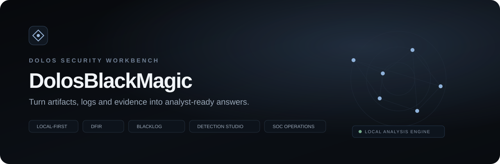

<div align="center">



# DolosBlackMagic

**Local-first browser DFIR · Log Intelligence · Detection Engineering · Evidence · Investigation · SOC Operations**

[](package.json)
[](package.json)
[](.github/workflows/ci.yml)
[](https://shalvalekishvili.github.io/DolosBlackMagic/)
[](LICENSE)

**[Live Application](https://shalvalekishvili.github.io/DolosBlackMagic/)** · **[ქართული განმარტება](#-ქართული-განმარტება)** · **[Architecture](docs/ARCHITECTURE.md)** · **[Security](docs/SECURITY.md)** · **[v0.8 Release](docs/V0.8.md)**

</div>

---

## What is DolosBlackMagic?

DolosBlackMagic 0.8.0 is a **privacy-first, browser-based DFIR/SOC analyst workstation** for local artifact inspection, heterogeneous telemetry analysis, evidence-driven detections, investigation continuity, incident handling and reporting.

Core analysis remains local to the browser. The project does **not** require a mandatory backend, account, telemetry service, analytics platform or paid dependency.

> DolosBlackMagic is analyst-assistance software. It is not an antivirus, EDR, malware sandbox, full SIEM backend, exploit framework or authoritative threat-intelligence verdict engine.

## v0.8 — Storage & Investigation Reliability

v0.8 builds on the v0.7 Analyst Data Platform and strengthens the product's browser-local persistence model without abandoning static hosting or privacy.

### Added in v0.8

- **Local Dataset Vault** backed by IndexedDB for opt-in persistence of selected telemetry collections;
- explicit dataset schema/version metadata;
- dataset size and event-count safety bounds;
- compact event persistence that avoids retaining arbitrary raw objects;
- saved dataset reopen flow back into Event Explorer;
- browser storage quota/usage visibility where supported;
- optional request for durable browser storage;
- investigation-aware dataset scoping;
- dedicated storage regression tests;
- v0.8 PWA/static integrity enforcement for the new platform assets.

### Preserved from v0.7

- chunked `File`/`Blob` ingestion for line-oriented telemetry;
- Web Worker parsing/detection pipeline with cancellation and measurable progress;
- stable evidence references and provenance;
- first-class investigation model;
- Event Explorer evidence drawer and bookmarks;
- Detection Engine v3 nested conditions, thresholds, distinct counts and bounded sequences;
- validated local investigation snapshots.

## Workstation map

| Workspace | Analyst purpose | Key capabilities |
|---|---|---|
| **Overview** | Current workspace state | local workspace pulse and quick actions |
| **Artifact Analysis** | Inspect local evidence | hashes, signatures, entropy, strings, IOC extraction, heuristic context |
| **Event Explorer / BlackLog** | Analyze telemetry | parsing, streaming ingestion, normalization, filters, evidence drawer |
| **Detection Studio** | Engineer rules | lifecycle, testing, safe regex, Sigma-like and Wazuh imports |
| **SOC Operations** | Triage and organize | findings, suppression, incidents, entity correlation, snapshots |
| **Investigation Graph** | Explore relationships | hosts, users, IPs, processes, domains, URLs, hashes and findings |
| **Case Timeline** | Order evidence | source telemetry and investigation chronology |
| **Indicators** | Review IOCs | extraction, defanging and pivots |
| **Investigations** | Preserve analyst context | evidence bookmarks, notes, entities and Local Dataset Vault |
| **Reports** | Handoff findings | Markdown, JSON and print/PDF-ready output |

## Architecture at a glance

```text
Local artifact / file / log / text
              │
              ▼
┌────────────────────────────────────┐
│        Browser analyst shell       │
│ Artifact · Events · Detection · SOC│
└───────────────┬────────────────────┘
                │
       ┌────────▼──────────┐
       │ Platform services │
       │ Event bus         │
       │ Investigations    │
       │ Detection v3      │
       │ Streaming client  │
       │ Workspace store   │
       └───────┬───────────┘
               │
   ┌───────────┴─────────────┐
   │                         │
┌──▼────────────────┐  ┌────▼───────────────┐
│ Chunked log worker│  │ IndexedDB Dataset  │
│ parse / normalize │  │ Vault (opt-in)     │
│ detect / correlate│  │ selected telemetry │
│ provenance        │  │ only               │
└────────┬──────────┘  └────────────────────┘
         │
 Findings + Evidence IDs
         │
 Investigation → Incident → Report

No mandatory backend · No analytics · No automatic sample upload
```

The older workstation engines remain a compatibility layer while stable capabilities are progressively consolidated into semantic `site/platform/` modules. This avoids a risky rewrite while reducing future patch stacking.

## Large telemetry processing

For line-oriented file ingestion, the streaming client reads bounded `Blob.slice()` chunks and sends decoded text incrementally to a dedicated worker. The worker reconstructs line boundaries, analyzes batches and emits measurable progress based on bytes and records processed.

Cancellation terminates the active analysis and **does not commit an unfinished investigation result**.

Large single-object JSON and CSV continue to use the compatibility parser path to preserve parser semantics. They remain bounded by a browser safety ceiling rather than pretending to support unsafe streaming semantics.

## Local Dataset Vault

Telemetry persistence is **explicit**, not automatic. The analyst chooses when to save the currently loaded collection.

The vault:

- uses IndexedDB when available;
- stores a compact normalized representation rather than arbitrary raw event objects;
- keeps provenance previews bounded;
- caps a saved dataset at 50,000 events and approximately 24 MB;
- exposes storage usage/quota where the browser supports `navigator.storage.estimate()`;
- can request durable browser storage, but does not assume that the browser will grant it;
- allows a saved dataset to be reopened into Event Explorer without uploading it anywhere.

Investigation metadata remains compatible with the existing LocalStorage-backed v0.7 model. v0.8 does not silently delete or migrate older analyst work.

## Evidence provenance

Streamed events can carry deterministic investigation-local references:

```text
EVT-0000124
sourceFile: security.jsonl
recordIndex: 124
lineNumber: 124
parser: ndjson
rawPreview: ...
```

Byte ranges are only populated when accurately available; DolosBlackMagic does not fabricate offsets.

Evidence can be bookmarked into the active investigation and is retained as a compact subset containing normalized context plus provenance.

## Detection Engine v3

Detection logic remains declarative and defensive.

Supported concepts include:

- nested `all` / `any` / `not` conditions;
- equals / not-equals / contains / prefix / suffix;
- safe regex validation;
- numeric comparisons;
- grouped thresholds;
- time windows;
- distinct-value counts;
- bounded multi-stage sequences.

Example defensive correlations include authentication spray, success-after-failure and service-install/process sequences. Findings remain analyst-assistance signals and must be validated against environment context.

## Privacy & security model

- no mandatory backend or user account;
- no third-party analytics;
- no automatic IOC/hash/file submission;
- uploaded artifacts are not executed;
- imported rules remain declarative data;
- no `eval()` or `new Function()` for detection logic;
- custom regex receives browser-safety validation;
- large telemetry persistence is opt-in and browser-local;
- saved events are sanitized and bounded before IndexedDB persistence;
- Netlify deployment includes CSP and baseline privacy/security headers.

## Run locally

```bash
python3 -m http.server 8080 -d site
```

Open:

```text
http://127.0.0.1:8080
```

## Test

Node.js 24+ is required. Runtime dependencies are not required.

```bash
npm test
```

The regression gate covers artifact analysis, parsing/normalization, detection/correlation, SOC/operations state, regex safety, investigation behavior, worker protocol invariants, dataset persistence validation and static/PWA deployment integrity.

## Deploy

### GitHub Pages

`.github/workflows/pages.yml` runs the complete `npm test` gate before publishing `site/`.

**Live:** https://shalvalekishvili.github.io/DolosBlackMagic/

Relative paths keep the project compatible with the `/DolosBlackMagic/` GitHub Pages subpath.

### Netlify

`netlify.toml` publishes `site/` and applies CSP plus browser security/privacy headers.

---

# 🇬🇪 ქართული განმარტება

## რა არის DolosBlackMagic?

**DolosBlackMagic 0.8.0** არის ბრაუზერზე დაფუძნებული, local-first ტიპის **DFIR / SOC ანალიტიკოსის სამუშაო გარემო**. პროექტი აერთიანებს არტეფაქტის ანალიზს, სხვადასხვა ტიპის ლოგების დამუშავებას, დეტექციებს, evidence-ს, IOC-ებს, entity correlation-ს, investigation-ს, incident workflow-სა და ანგარიშგებას.

მთავარი პრინციპი რჩება **მონაცემების ლოკალურად დამუშავება** — უსაფრთხოების ფაილები და ლოგები არ საჭიროებს სავალდებულო cloud backend-ზე ატვირთვას.

## რა შეიცვალა v0.8-ში?

v0.8-ის მთავარი მიმართულებაა **Storage & Investigation Reliability**. v0.7-ში დამატებული streaming/evidence პლატფორმის შემდეგ უკვე შესაძლებელი გახდა analyst-ის მიერ არჩეული telemetry collection-ის უსაფრთხოდ და ლოკალურად შენახვა IndexedDB-ში.

### Local Dataset Vault

Investigations სამუშაო სივრცეში დაემატა Local Dataset Vault. მისი საშუალებით შეგიძლია მიმდინარე Event Explorer telemetry შეინახო ბრაუზერში და მოგვიანებით ხელახლა გახსნა.

მნიშვნელოვანი პრინციპებია:

- შენახვა ხდება მხოლოდ analyst-ის მოქმედებით — ავტომატური persistence არ ხდება;
- მონაცემები არ იგზავნება server/cloud-ზე;
- IndexedDB გამოიყენება დიდი structured მონაცემებისთვის;
- event-ები persistence-მდე გადიან sanitization-ს;
- arbitrary raw object სრულად არ ინახება;
- raw preview და გრძელი ტექსტური ველები bounded-ია;
- თითო dataset-ზე მოქმედებს 50,000 event და დაახლოებით 24 MB safety limit;
- შესაძლებელია browser storage usage/quota-ის ნახვა;
- მხარდაჭერის შემთხვევაში შესაძლებელია durable storage-ის მოთხოვნაც.

### დიდი ლოგების chunked დამუშავება

line-oriented telemetry-სთვის pipeline კვლავ იყენებს `Blob.slice()` + Web Worker არქიტექტურას. worker protocol მოიცავს:

```text
START
CHUNK
PROGRESS
PARTIAL_RESULT
COMPLETE
CANCEL
ERROR
```

Progress ეფუძნება რეალურად დამუშავებულ byte-ებსა და record-ებს.

JSON array/single-object და CSV compatibility parser-ზე რჩება, რათა chunk boundary-ებმა parser semantics არ შეცვალოს.

### Evidence Provenance

streamed event-ებს აქვთ სტაბილური reference, მაგალითად `EVT-0000124`, და შესაძლებელია source file, record index, line number, parser და bounded raw preview-ის შენახვა.

### Investigation Model

Investigation ინახავს data source-ებს, bookmarked evidence-ს, findings-ს, entities-ს, notes-ს, timeline-ს, analyst actions-ს, incident reference-ებსა და saved filter-ებს. v0.8 არსებული v0.7 LocalStorage state-ს არ შლის.

### Detection Engine v3

დეტექციები კვლავ declarative მონაცემებია და მხარდაჭერილია nested AND/OR/NOT, threshold, time window, group-by, distinct count, sequence stages და safe regex validation.

## კონფიდენციალურობა

DolosBlackMagic:

- არ მოითხოვს ანგარიშს;
- არ აგზავნის telemetry-ს analytics პლატფორმაზე;
- ავტომატურად არ აგზავნის hash/IP/domain/file მონაცემებს მესამე მხარეს;
- არ ასრულებს ატვირთულ ფაილებს;
- არ იყენებს `eval()`-ს custom detection logic-ისთვის;
- დიდ telemetry collection-ს ინახავს მხოლოდ შენი პირდაპირი მოთხოვნით;
- Dataset Vault მთლიანად browser-local IndexedDB-ზე მუშაობს.

## ლოკალურად გაშვება

```bash
python3 -m http.server 8080 -d site
```

შემდეგ გახსენი:

```text
http://127.0.0.1:8080
```

## ტესტირება

```bash
npm test
```

საჭიროა Node.js 24 ან უფრო ახალი.

---

## Project structure

```text
DolosBlackMagic/
├── site/
│   ├── platform/
│   │   ├── app-bus.js
│   │   ├── investigation-engine.js
│   │   ├── detection-v3.js
│   │   ├── workspace-store.js
│   │   ├── dataset-vault-ui.js
│   │   ├── log-stream-client.js
│   │   ├── log-stream-worker.js
│   │   ├── event-explorer-v2.js
│   │   ├── investigation-ui.js
│   │   ├── global-search.js
│   │   ├── bootstrap.js
│   │   └── platform.css
│   ├── core.js / app.js
│   ├── log-engine.js / log-ui.js / log-worker.js
│   ├── soc-engine.js / soc-ui.js
│   ├── ops-engine.js / ops-ui.js
│   ├── sw.js / manifest.webmanifest
├── tests/
│   ├── platform.test.mjs
│   ├── streaming.test.mjs
│   ├── storage.test.mjs
│   └── existing regression suites
├── docs/
├── scripts/check-static.mjs
├── .github/workflows/
├── netlify.toml
└── package.json
```

## Documentation

- [Architecture](docs/ARCHITECTURE.md)
- [Detections](docs/DETECTIONS.md)
- [Log formats](docs/LOG_FORMATS.md)
- [Privacy](docs/PRIVACY.md)
- [Security](docs/SECURITY.md)
- [Testing](docs/TESTING.md)
- [v0.6 release](docs/V0.6.md)
- [v0.7 release](docs/V0.7.md)
- [v0.8 release](docs/V0.8.md)

## License

MIT
